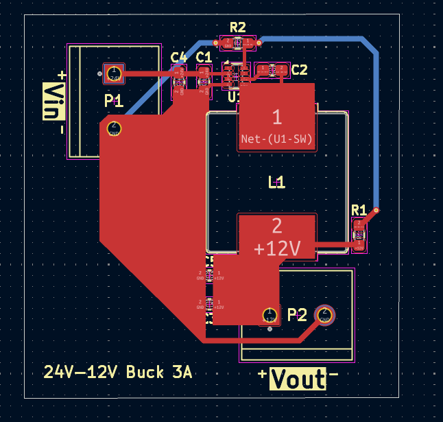
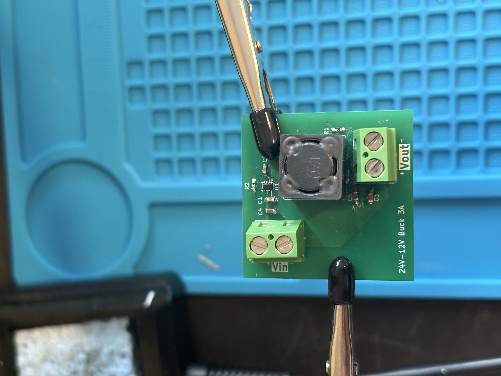
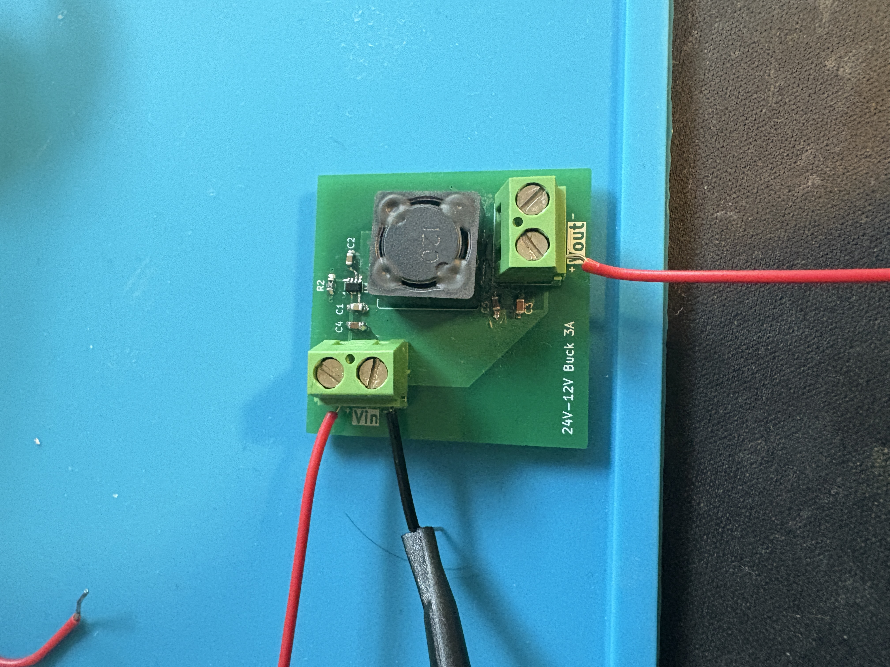

# Buck Converter - Power Distribution (12V-24V @3A) - TrickFire Robotics 
Independently developed a 24V-12V buck converter using the TPS563300 IC designed to operate at 3A for use in TrickFire Robotics power distribution system. Performed calculations to find ideal component values for best performance while refering to the IC datasheet. Designed schematics and PCBs on KiCAD iterating and refining prototypes as I learned from previous mistakes.

| Parameter | Value |
| :--- | :--- |
| **Input Voltage** | 24V |
| **Output Voltage** | 12V |
| **Max Current** | 3A |

## Schematic And PCB Design

To develop the buck converter schematic I frequently refered to the main operating ICs datasheet: [datasheet](https://www.ti.com/lit/ds/symlink/tps563300.pdf)

It provides formulas and specifications of the buck IC I used to develop this schematic. When selecting footprints for my components, I opted for the 0603 package when possible. For the resistors and capacitors, selecting the handsolder footprint made handsoldering my PCB much easier later on. In my first iteration of schematic design, I made the mistake of choosing an inductor footprint that was only tolerated for a current of ~250mA. When double checking my work, however, I found this mistake and quickly sought another component that could support my desired specifications of 3A. Luckily this fix was easy at this stage in the project, but if left overlooked, my final design wouldn't have worked as intended and costed the project time and money to fix. I quickly found a replacement and ensured my other components were rated for this current and voltage.

Based on the [datasheet](https://www.ti.com/lit/ds/symlink/tps563300.pdf), the following layout/placement strategies were employed:

*  Placed IC, inductor, and caps on the same side of the board.
*  Positioned input/output caps as close to the IC as possible.
*  Placed 0.1µF decoupling caps directly next to the power pins.
*  Kept the switching trace small and current loop small to minimize noise.
*  Positioned the FB divider near the pin and away from noisy power traces.

In my initial design, I emphasized the placement stratigies listed above but once again failed to account for the 3A of current flowing through the buck. I used the default trace size of 0.2mm for my 24V input line when I should've used around 0.5mm to support 3A of current. With the 0.2mm trace, my buck could only provide less than an amp of current. I stumbled upon this issue when doing research about PCB design and learned that when dealing with power distribution systems, trace width and trace size really matters. Initially, this wasn't something that I emphasized enough. Below is my revised pcb where I increased the trace size, adjusted placements, and created a ground plane:

The followng image shows the 3D render of the PCB design above:

## Results

| Soldered Buck | Testing Soldered Buck |
| :---: | :---: |
|  |  |

