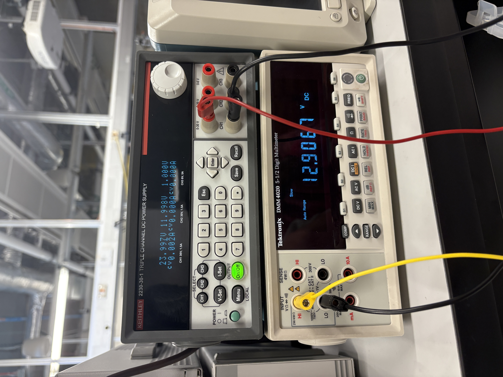

# Buck Converter - Power Distribution (12V-24V @3A) - TrickFire Robotics 
Independently developed a 24V-12V buck converter using the TPS563300 IC designed to operate at 3A for use in TrickFire Robotics power distribution system. Performed calculations to find ideal component values for best performance while referring to the IC datasheet. Designed schematics and PCBs on KiCAD iterating and refining prototypes as I learned from previous mistakes.

| Parameter | Value |
| :--- | :--- |
| **Input Voltage** | 24V |
| **Output Voltage** | 12V |
| **Max Current** | 3A |

## Schematic And PCB Design

To develop the buck converter schematic I frequently referred to the main operating IC's datasheet: [datasheet](https://www.ti.com/lit/ds/symlink/tps563300.pdf)

It provides formulas and specifications of the buck IC I used to develop this schematic. When selecting footprints for my components, I opted for the 0603 package when possible. For the resistors and capacitors, selecting the handsolder footprint made handsoldering my PCB much easier later on. In my first iteration of schematic design, I made the mistake of choosing an inductor footprint that was only rated for a current of ~250mA. When double checking my work, however, I found this mistake and quickly sought another component that could support my desired specifications of 3A. Luckily this fix was easy at this stage in the project, but if left overlooked, my final design wouldn't have worked as intended and cost the project time and money to fix. I quickly found a replacement and ensured my other components were rated for this current and voltage.

Based on the [datasheet](https://www.ti.com/lit/ds/symlink/tps563300.pdf), the following layout/placement strategies were employed:

*  Placed IC, inductor, and caps on the same side of the board.
*  Positioned input/output caps as close to the IC as possible.
*  Placed 0.1µF decoupling caps directly next to the power pins.
*  Kept the switching trace small and current loop small to minimize noise.
*  Positioned the FB divider near the pin and away from noisy power traces.

In my initial design, I emphasized the placement strategies listed above but once again failed to account for the 3A of current flowing through the buck. I used the default trace size of 0.2mm for my 24V input line when I should've used around 0.5mm to support 3A of current. With the 0.2mm trace, my buck could only provide less than an amp of current. I stumbled upon this issue when doing research about PCB design and learned that when dealing with power distribution systems, trace width and trace size really matters. Initially, this wasn't something that I emphasized enough. Below is my revised pcb where I increased the trace size, adjusted placements, and created a ground plane:

The followng image shows the 3D render of the PCB design above:

| **PCB Layout 3D Render** |
| :---: |
|  |

 

## Results
| **Soldered Buck** |
| :---: |
|  |

When soldering the pcb, I found the greatest challenge was handsoldering the TPS563300 IC. It was about the size of two grains of rice side by side, and it was an 8 pin IC. However, with patience and some flux, I was able to solder the IC, esuring no shorts between legs. When soldering the big inductor, I found success in swapping my soldering iron's tip to a large chisel that transfered heat easily. The 0603 package parts were pretty straight forward. Using a fine gauge leaded solder made soldering these components easy.

| **Output of Buck Converter (24V Input)** |
| :---: |
|  |

Finally I was able to test my 24V-12V buck converter. As to not immediately damage the buck converter, I used a lab bench multimeter which has a very large internal resistance. When measuring the output voltage, I could ensure there would be a very small amount of current and could specifically measure the output voltage without the risk of damaging anything. I found 12.9V at the output, which seemed to be a good sign. This error could very well be attributed to component tolerances, inaccuracy in the IC, or filtering issues. If I desired a cleaner output, I would switch to more (expensive) tolerant resistors and improve input and output filtering.

 

## Conclussion

My previous experience in pcb design had been in communication systems using the ATmega328p microcontroller and several sensors through I2C communication in my Heartrate Monitor Smartwatch. However, this project introduced me to basic power electronics and pcb deign strategies to employ when dealing with higher voltages and currents. In communication, I was dealing with digital electronics and the goal was signal integrity to ensure data reached the sensors. In power electronics, however, traces will burn if they aren't wide enough for the current, components must be strictly rated for the voltage and current, and component placements can have a large impact on the electromagnetic interference. 

This project has served as a great introduction to one of the many subfields of Electrical Engineering where I have been able to apply and expand upon class concepts. I can't wait to dive deeper into the world of power electronics for future projects.  
