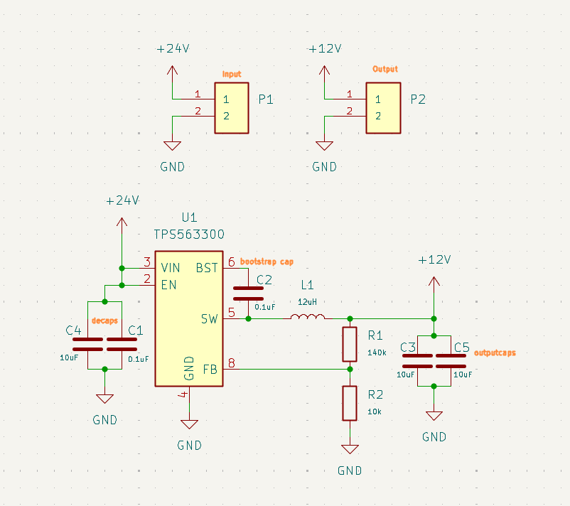
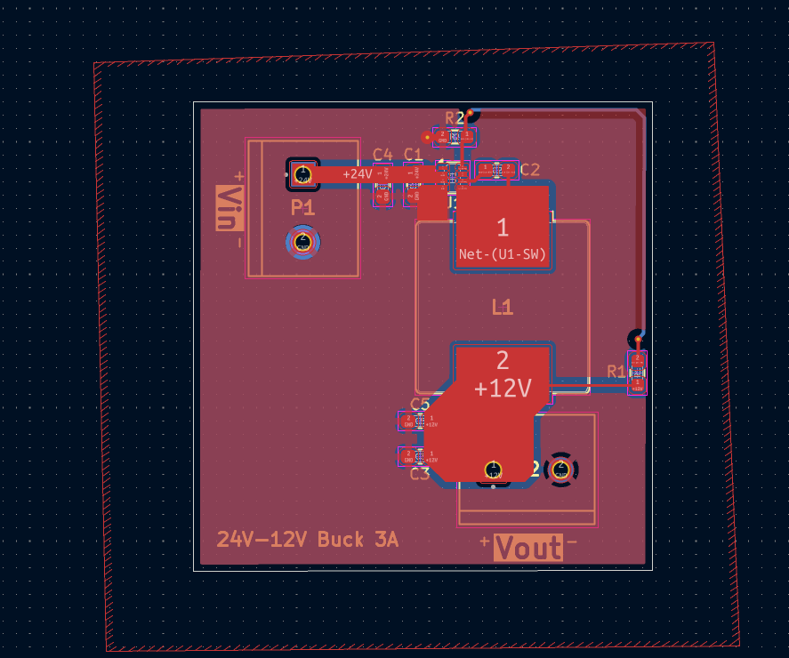
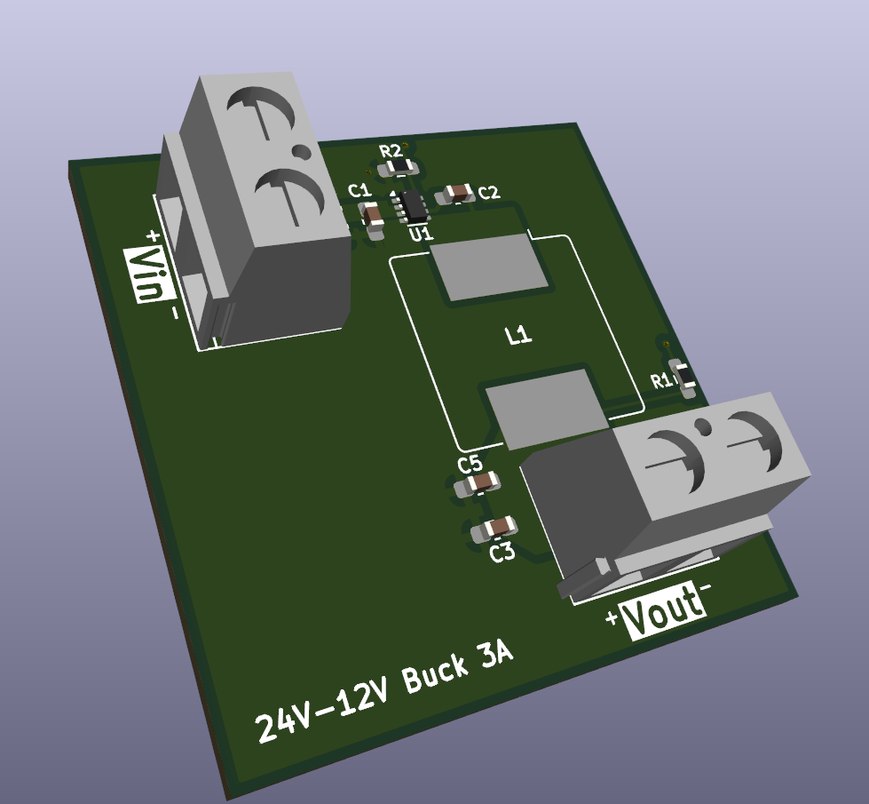

# Buck-Converter---TrickFire-Robotics
Independently developed a 24V-12V buck converter using the TPS563300 IC designed to operate at 3A. Performed calculations to find ideal component values for best performance while refering to the IC datasheet. Designed schematics and PCBs on KiCAD iterating through prototypes as I learned from mistakes.

| Parameter | Value |
| :--- | :--- |
| **Input Voltage** | 24V |
| **Output Voltage** | 12V |
| **Max Current** | 3A |

## Visuals

To develop the buck converter schematic I frequently refered to the main operating ICs datasheet: [datasheet](https://www.ti.com/lit/ds/symlink/tps563300.pdf)

It provides formulas and specifications of the buck IC I used to develop this schematic. When selecting footprints for my components, I opted for the 0603 package when possible. For the resistors and capacitors, selecting the handsolder footprint made handsoldering my PCB much easier later on. 

Based on the [datasheet](https://www.ti.com/lit/ds/symlink/tps563300.pdf), the following layout/placement strategies were employed:

* **Integrated Power Path:** Placed the inductor, IC, and input/output capacitors on the **same layer** to minimize parasitic inductance.
* **Minimized Switching Loops:** Positioned input and output capacitors as close as possible to the IC pins.
* **High-Current Traces:** Utilized **wide VIN and GND traces** with redundant vias to reduce impedance and improve heat dissipation.
* **EMI Suppression:** Dedicated **0.1µF decoupling capacitors** placed immediately adjacent to the VIN and GND pins.
* **Optimized SW Node:** Kept the Switching (SW) trace as short and wide as practical to reduce radiated emissions.
* **BST Network:** Located the BST capacitor and resistor near the BST/SW pins using **>10-mil** trace widths.
* **Feedback Integrity:** Placed the feedback divider near the FB pin, isolated from high-voltage switching traces, and utilized a **ground shield** for the feedback loop.

